# After Hours


**A detective puzzle mini-game built with JavaScript (DOM-based)**

After Hours is an interactive crime investigation game where players take on the role of one of two inspectors — **Jared** or **Chris** — each with their own unique case to solve. Players must gather evidence, solve puzzles, interrogate suspects, and ultimately identify the correct culprit before time runs out.

> Developed by **Jared Laordin** & **Chris Allen Gonzales**  
> UPHSD Molino — College of Computer Studies  
> Programming 2: 2-Week Game Sprint

---

## Table of Contents

- [Game Description](#game-description)
- [Features](#features)
- [Setup Instructions](#setup-instructions)
- [Controls](#controls)
- [Game Flow](#game-flow)
- [Puzzle Logic](#puzzle-logic)
- [Project Structure](#project-structure)
- [Tech Stack](#tech-stack)
- [Screenshots](#screenshots)
- [Contributors](#contributors)

---

## Game Description

After Hours is a narrative-driven detective puzzle game with two playable cases:

- **Bad Blood (Inspector Jared)** — Investigate the mysterious case at Elijah's house. Restore power via a wire puzzle, collect crime scene evidence under a timed countdown, interrogate three suspects, profile the culprit, and make the arrest.

- **Chris Case (Inspector Chris)** — Investigate the Benjots arson case. Examine the fire scene, solve the electrical circuit puzzle, analyze receipt evidence, interrogate suspects, and file a search warrant to catch the arsonist.

Each case features a full gameplay loop: **Main Menu → Case Selection → Office Briefing → Crime Scene Investigation → Puzzles → Evidence Collection → Suspect Interrogation → Accusation → Case Result.**

---

## Features

- **Main Menu** with Play, Settings (volume, auto-dialogue), and Credits
- **Two unique cases** with different stories, suspects, and evidence
- **Puzzle mechanics**: Wire connection puzzle, image reconstruction tile puzzle, receipt analysis puzzle
- **Timed crime scene investigation** with interactive evidence collection
- **Suspect interrogation system** with dialogue scripts per suspect
- **Scoring & ranking** system (stars, rank, time bonus, evidence bonus)
- **Case result screen** with pass/fail, outro, and jail visual
- **Skip dialogue button** for streamlined replays
- **Responsive UI** with custom cursor, transitions, and sound effects
- **Background music & SFX** with volume controls

---

## Setup Instructions

### Prerequisites
- A modern web browser (Chrome, Firefox, Edge, or Safari)
- No server or installation required — the game runs entirely client-side

### How to Run
1. **Clone the repository:**
   ```bash
   git clone https://github.com/whoopjared/LAORDIN-GONZALES-REPO.git
   ```
2. **Navigate to the game folder:**
   ```bash
   cd LAORDIN-GONZALES-REPO/javascript
   ```
3. **Open `index.html` in your browser:**
   - Double-click `index.html`, or
   - Right-click → Open with → your preferred browser, or
   - Use a local server like VS Code's Live Server extension

> **Note:** Audio and images use relative paths (`../images/`, `../audios/`), so the file must be opened from within the `javascript/` directory.

---

## Controls

| Action | Input |
|---|---|
| Navigate menus | Mouse click / Tap |
| Advance dialogue | Click dialogue bubble / Tap |
| Skip all dialogue | Click **SKIP ▸▸** button |
| Collect evidence | Click highlighted items on crime scene |
| Solve wire puzzle | Click matching wire endpoints by color |
| Solve tile puzzle | Tap one tile, then tap another to swap |
| Select suspect | Click suspect card, then Interrogate / Arrest |
| Pause game | Press **Escape** or click pause icon |
| Adjust volume | Use slider in Settings or pause menu |

---

## Game Flow

```
Main Menu
  └─ Play
       └─ Select Inspector (Jared / Chris)
            └─ Select Case from Map
                 └─ Office Briefing (dialogue)
                      └─ Crime Scene Investigation
                           ├─ Puzzle (Wire / Tile / Receipt)
                           ├─ Timed Evidence Collection
                           └─ Evidence Dialogue
                      └─ Level Cleared
                           └─ Post-Investigation Office
                                └─ Suspect Lineup
                                     └─ Interrogation (3 suspects)
                                          └─ Profiling / Warrant Phase
                                               └─ Accusation
                                                    ├─ Correct → Case Closed Outro → Score
                                                    └─ Wrong → Mission Failed
```

---

## Puzzle Logic

The game implements three distinct puzzle types, each requiring **pattern recognition** and **state management**:

### 1. Wire Connection Puzzle
- Players must connect pairs of colored wire endpoints
- Uses **state tracking** for each wire pair (connected/disconnected)
- Validates all connections before marking solved
- Appears in both Jared's case (restore house power) and Chris's case (test circuit at Benjots)

### 2. Image Reconstruction Puzzle (Tile Swap)
- A 3×3 grid of shuffled tiles from a photograph
- Players tap two tiles to swap them into correct positions
- Uses **Fisher-Yates shuffle** for randomization ensuring a solvable start
- Tracks move count and provides visual feedback for correctly-placed tiles
- Requires **spatial reasoning and pattern recognition**

### 3. Receipt Analysis Puzzle (Chris Case)
- Players examine receipt evidence to identify discrepancies
- Connects suspect statements to physical evidence
- Tests **deductive reasoning** and attention to detail

---

## Project Structure

```
LAORDIN-GONZALES-REPO/
├── README.md
├── javascript/
│   └── index.html          # Main game file (HTML + CSS + JS)
├── images/
│   ├── logo/                # Game logo assets
│   ├── mainmenu-banners/    # Main menu slideshow banners
│   ├── mainmenu-buttons/    # UI button images
│   ├── map/                 # Level selection map
│   ├── case-pick/           # Inspector selection images
│   ├── level-thumbnail/     # Case thumbnail images
│   ├── credits-img/         # Developer photos
│   ├── jared-case-images/   # Jared case assets
│   │   ├── characters/      # Character sprites & emotes
│   │   ├── elijahsHouse/    # Crime scene backgrounds
│   │   ├── items/           # Evidence items & puzzles
│   │   └── office/          # Office background
│   └── chris-case-images/   # Chris case assets
│       ├── characters/      # Character sprites & emotes
│       ├── benjots/          # Crime scene backgrounds
│       ├── items/           # Evidence items
│       ├── matthew-house/   # Search warrant scene
│       └── office/          # Office background
└── audios/
    ├── theme/               # Background music & outro
    └── *.mp3                # SFX (clicks, whoosh, sirens, etc.)
```

---

## Tech Stack

- **Language:** JavaScript (ES6+)
- **Rendering:** DOM-based (no Canvas, no external frameworks)
- **Styling:** Inline CSS + embedded `<style>` block
- **Audio:** HTML5 `<audio>` elements
- **Version Control:** Git + GitHub

---

## Screenshots

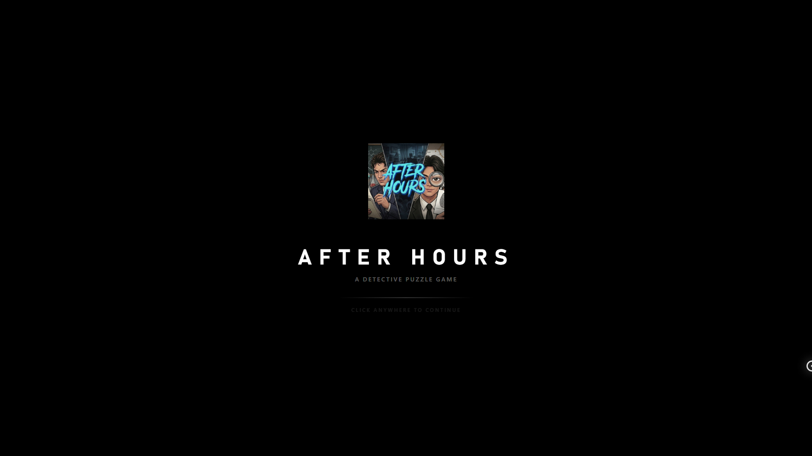
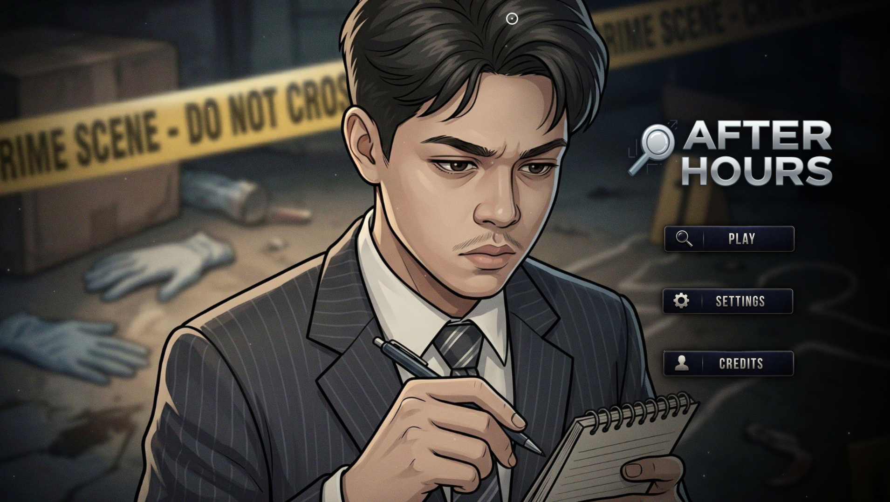
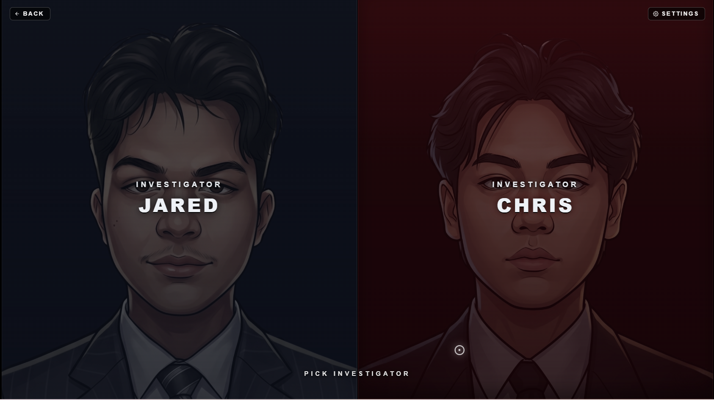
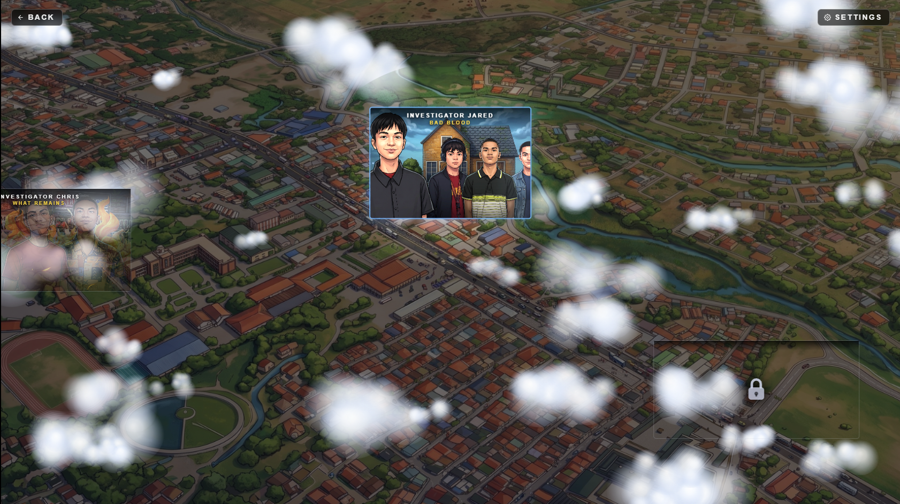
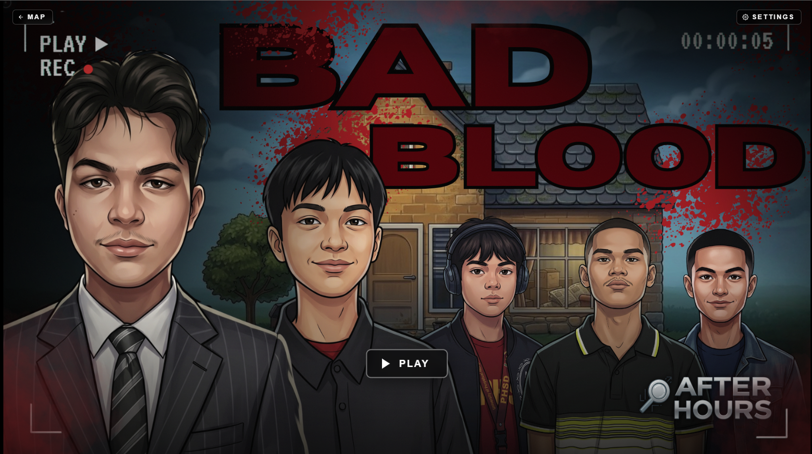
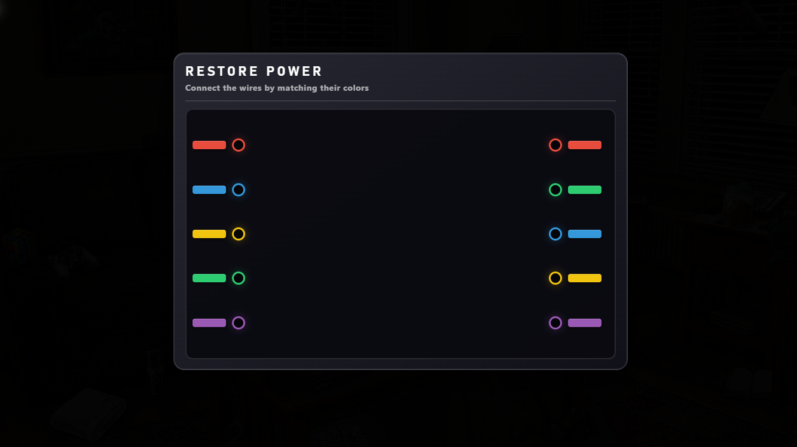
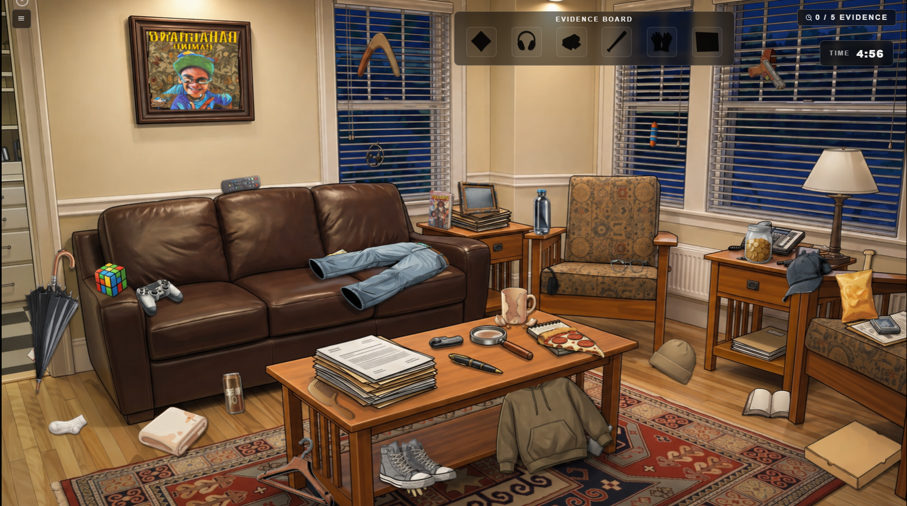
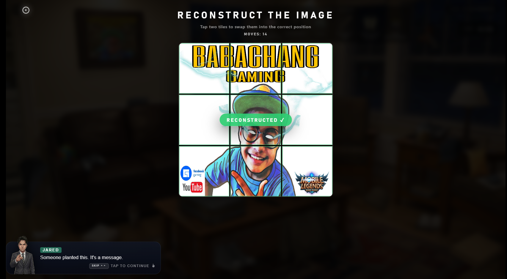
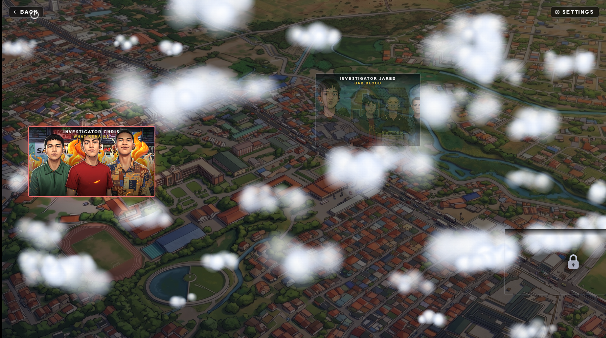
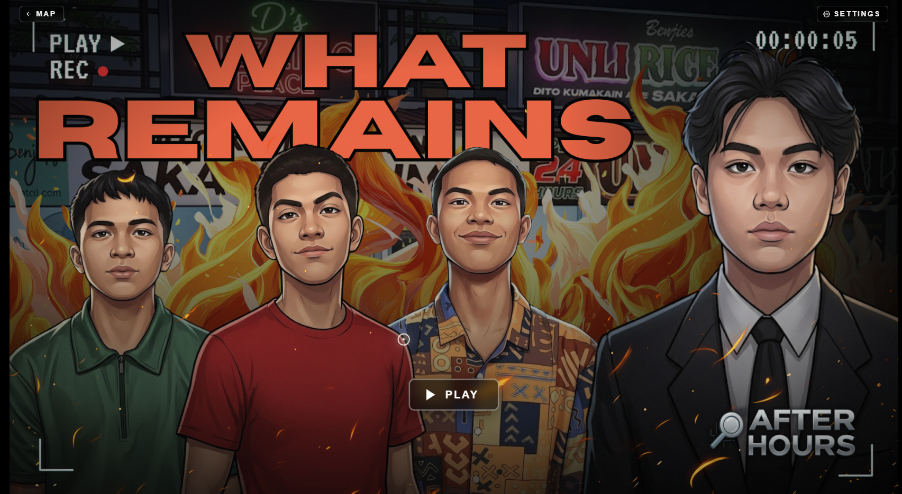
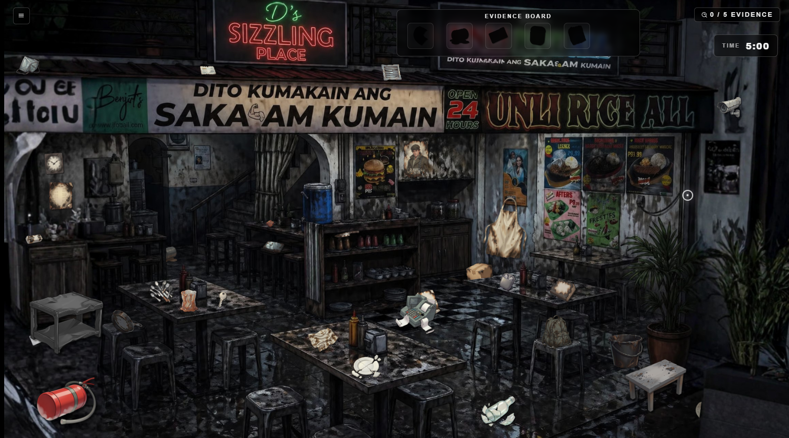
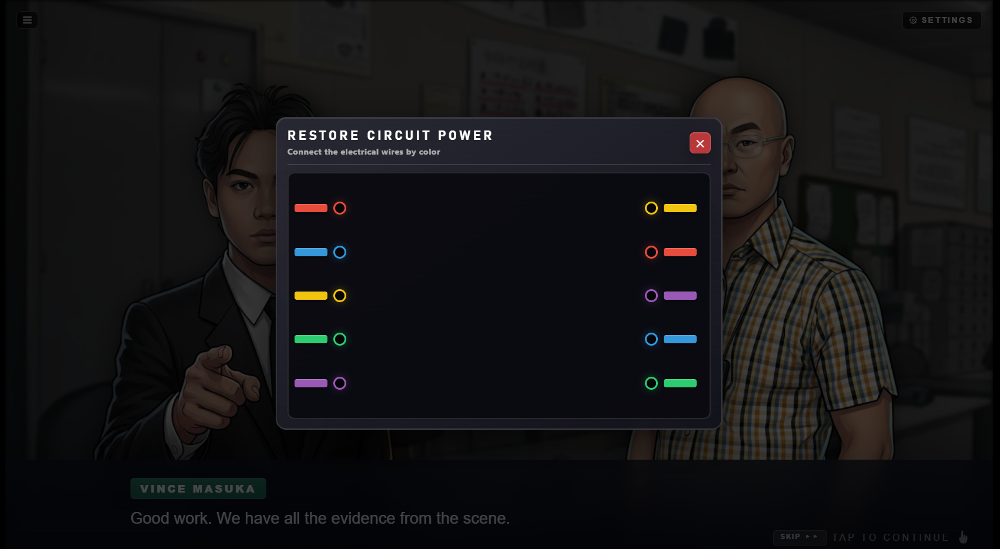
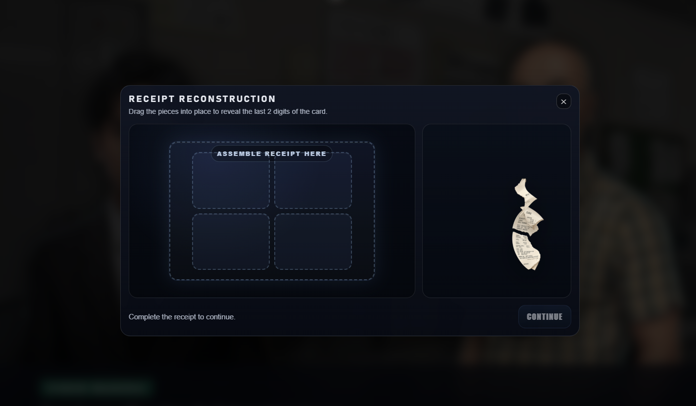
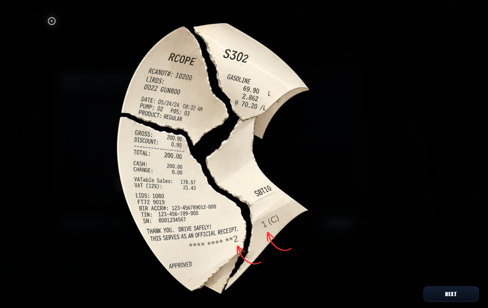
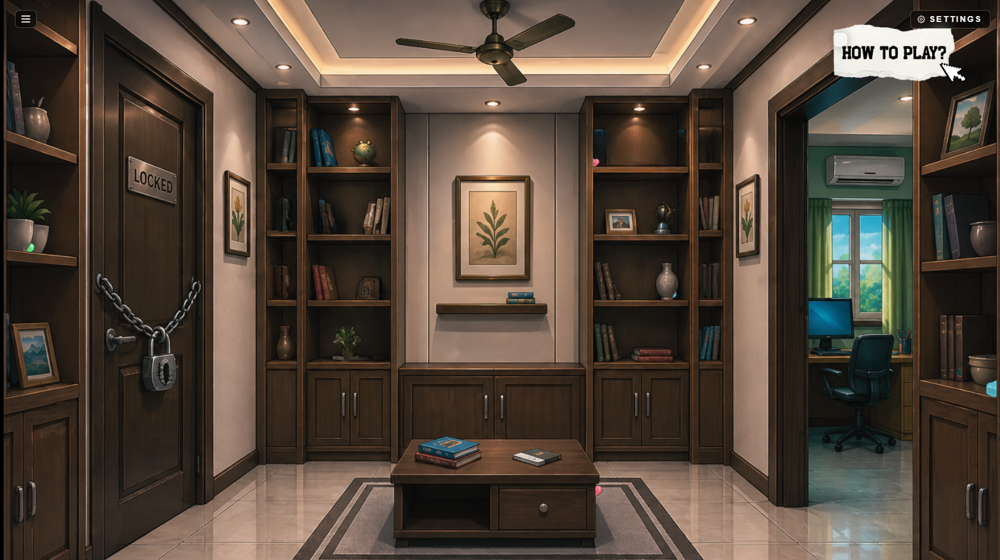


<!-- 
Add screenshots like this:


-->

---

## Contributors

| Name | Role | GitHub |
|---|---|---|
| **Jared Laordin** | Lead Developer — Game logic, puzzle systems, dialogue engine, scene management, UI/UX, audio integration | [@whoopjared](https://github.com/whoopjared) |
| **Chris Allen Gonzales** | Co-Developer — Asset creation, case content, character designs, level design, UI assets, testing | [@c1rbyy](https://github.com/c1rbyy) |

---

## License

This project was created for academic purposes as part of the Programming 2 course at UPHSD Molino — College of Computer Studies.
